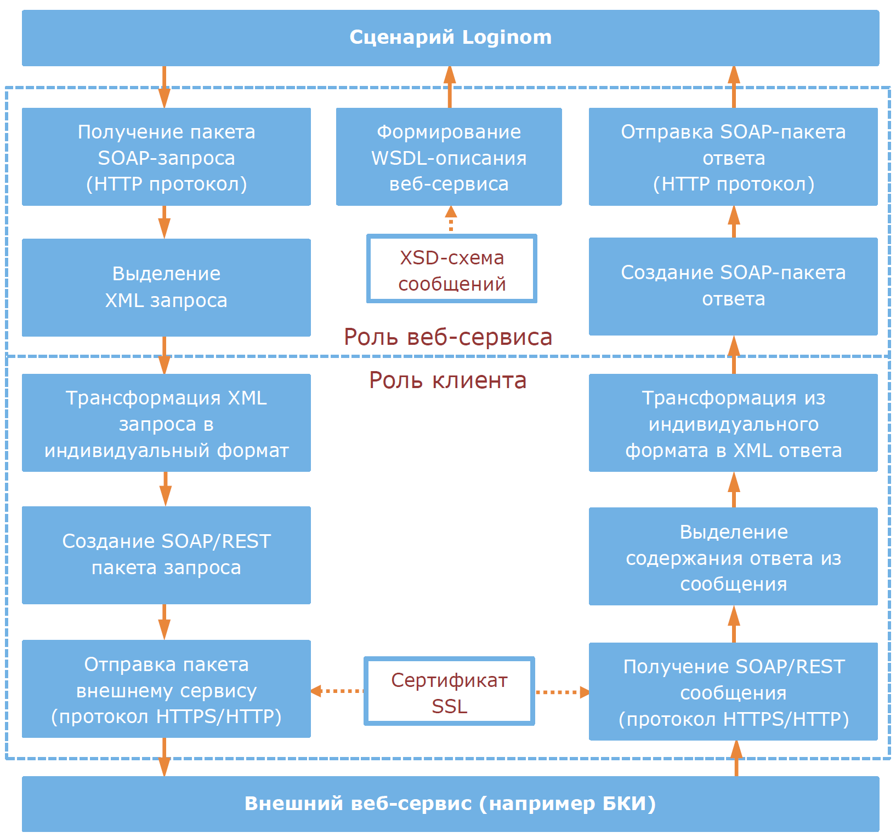
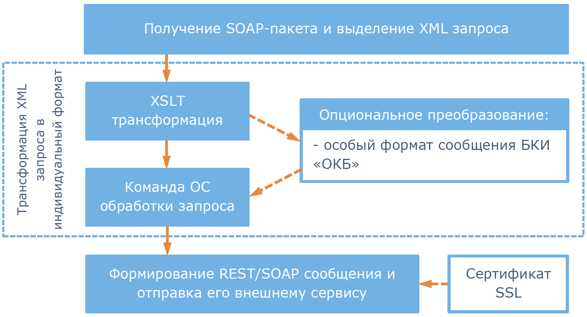
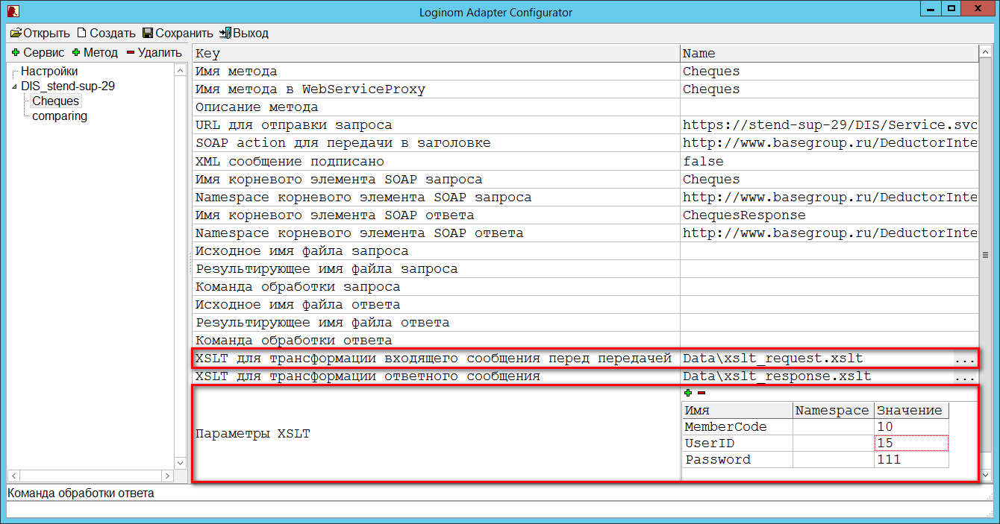
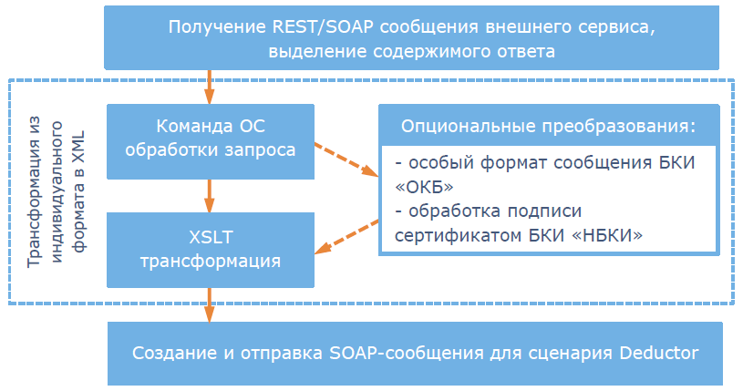

# Принципы работы и настройки

## Функциональная схема работы

Являясь промежуточным веб-сервисом, *Адаптер* одновременно выполняет роль клиента по отношению к внешнему сервису (например, к бюро кредитных историй – БКИ) и роль SOAP-веб-сервиса по отношению к сценарию Loginom (или любому другому стороннему потребителю информации). Выполняя роль веб-сервиса, *Адаптер* предоставляет WSDL-описание в соответствии со стандартом SOAP. WSDL-описание однозначно определяет параметры взаимодействия с веб-сервисом, в том числе и форматы XML-сообщений, посредством которых это взаимодействие осуществляется. С другой стороны, выполняя роль клиента, *Адаптер* обеспечивает трансформацию этих сообщений из формата SOAP в индивидуальные форматы внешних сервисов и обратно.

Функциональная схема работы *Адаптера* представлена на рисунке 7.



## Настройка роли клиента внешних сервисов

Алгоритм действий на этапе отправки запроса внешнему сервису представлен на рисунке 8.



Как видно из рисунка 8, первым действием после получения SOAP-запроса из сценария Loginom является выделение текста xml-запроса из SOAP-пакета. Согласно описанию SOAP-протокола, xml-запрос к веб-сервису содержится в теле узла `Body` SOAP-пакета. Пример SOAP-пакета приведен ниже:

```XML
<soapenv:Envelope xmlns:soapenv="http://schemas.xmlsoap.org/soap/envelope/"
xmlns:ded="http://www.basegroup.ru/DeductorIntegrationServer">
<soapenv:Header/>
    <soapenv:Body>
        <ded:Cheques>
            <variables>
                <DateMin>2000-06-06T23:59:00</DateMin>
                <DateMax>2017-06-06T23:59:00</DateMax>
            </variables>
        </ded:Cheques>
    </soapenv:Body>
</soapenv:Envelope>
```

Для приведенного примера из SOAP-пакета будет выделен узел `ded:Cheques`, и дальнейшая трансформация на следующих этапах будет производиться с текстом xml:

```XML
<ded:Cheques>
    <variables>
        <DateMin>2000-06-06T23:59:00</DateMin>
        <DateMax>2017-06-06T23:59:00</DateMax>
    </variables>
</ded:Cheques>
```

Первым этапом преобразования XML запроса может быть XSLT трансформация. Настройка выполнения этого этапа производится с помощью параметров *Конфигуратора* *XSLT для трансформации входящего сообщения перед передачей* и *Параметры XSLT*, представленных на рисунке 9.



Параметр *XSLT для трансформации входящего сообщения перед передачей* содержит путь к скрипту xslt. В самом скрипте могут быть определены входные параметры, как это показано в следующем примере:

```XML
<?xml version="1.0" encoding="UTF-8"?>
<xsl:stylesheet version="1.0" xmlns:xsl="http://www.w3.org/1999/XSL/Transform" xmlns:fo="http://www.w3.org/1999/XSL/Format">
<xsl:output method="xml" version="1.0" encoding="UTF-8" indent="yes"/>

<xsl:param name="MemberCode"/>
<xsl:param name="UserID"/>
<xsl:param name="Password"/>

<xsl:template match="@* | node()">
    <xsl:copy>
        <xsl:apply-templates select="@* | node()"/>
    . . . .
</xsl:stylesheet>
```

Здесь в теле скрипта описаны параметры `MemberCode`, `UserID`, `Password`, принимающие значения, заданные в *Конфигураторе*.

Если значение параметра *XSLT для трансформации входящего сообщения перед передачей* не задано, то этап XSLT трансформации не выполняется.

Следующим этапом может быть преобразование в особый формат сообщения БКИ «ОКБ». Данное преобразование специфично для работы с вышеуказанным БКИ и в других задачах не применяется. Настройка выполнения этого этапа осуществляется параметром *Особый формат сообщения*.

Следующим этапом обработки может быть применение команды ОС (операционной системы). Выполнение этого этапа определяется параметрами *Конфигуратора*: *Исходное имя файла запроса*, *Результирующее имя файла запроса*, *Команда обработки файла запроса*. Пример команды:

```
"C:\Program Files\7-Zip\7z" a -tzip "%outputFile%" "%inputFile%"
```

Здесь шаблоны `%inputFile%` и `%outputFile%` при выполнении команды заменяются на значения параметров *Исходное имя файла запроса* и *Результирующее имя файла запроса* соответственно. В этих параметрах могут быть заданы полные пути к файлам, либо только имена файлов. При отсутствии полного пути файлы будут располагаться в папке с `Web.config`.

Перед началом выполнения команды ОС результат предыдущих этапов преобразования представляется в виде файла с именем, указанным в параметре *Исходное имя файла запроса*, и записывается на диск. Далее команда ОС применяется к этому файлу и формирует выходной файл. Содержание выходного файла передается на следующий этап обработки.

В случае, если значения параметров *Исходное имя файла запроса* и *Результирующее имя файла запроса* не заданы, то будут сформированы имена файлов на основе случайно сгенерированных GUID (Globally Unique Identifier) без расширения. Эти временные файлы так же будут располагаться в папке с `Web.config`, а по окончании обработки удалятся.

Имена файлов так же можно задавать в виде шаблона с использованием конструкции `%guid%`. Например, на основе шаблона `"%guid%_reg.xml"` вместо `%guid%` в имя файла будет подставлен случайно сгенерированный GUID.

Эти правила выполнения этапа применяются и при преобразовании командой OC ответов сервиса с использованием параметров *Исходное имя файла ответа*, *Результирующее имя файла ответа*, *Команда обработки файла ответа*. Если параметр *Команда обработки файла запроса* не задан, то этап обработки *Команда OC* не выполняется. Конечным результатом этапов трансформации XML-запроса является формирование запроса в индивидуальном формате, заданном в описании внешнего сервиса, и может представлять собой XML, JSON, двоичные данные, текст и т.д. На следующем этапе полученный в результате предыдущих преобразований запрос в случае формирования REST-запроса помещается в тело HTTP/HTTPS пакета (*Entity Body*), отправляемого внешнему сервису, в случае SOAP-запроса – помещается внутрь узла `Body` SOAP-пакета.

Тип отправляемого запроса (REST или SOAP) определяется параметром *Формат сообщения*. Значение `plainXml` параметра задает формат REST-сообщения. Значения `soap` и `soap12` параметра задают формат SOAP-сообщения в спецификациях 1.1 и 1.2 соответственно.
При заполнении секций HTTP/HTTPS пакета, отправляемого внешнему сервису, также используются следующие параметры *Конфигуратора*:

| Секции HTTP/HTTPS пакета | Используемые для заполнения параметры *Конфигуратора* |
|:--------- |:-------------|
| Строка запроса (*Request Line*) | *URL для отправки запроса* |
| Заголовки (*Message Headers*) | Заголовок `Content-Type` заполняется значением параметра *ContentType для передачи в заголовке*. Заголовок `SOAPAction` заполняется значением параметра *SOAPAction, который необходимо передавать в заголовке*. |
| Тело сообщения (*Entity Body*) | Заполняется сформированным SOAP-пакетом или телом REST-сообщения в зависимости от значения параметра *Формат сообщения* |

При взаимодействии с внешними сервисами *Адаптер* использует только POST-запросы, GET-запросы не используются.

Пример HTTP/HTTPS пакета запроса к SOAP-сервису:

*Строка запроса (Request Line):*

```
POST https://stend-sup-29/DIS/Service.svc/ServiceClass HTTP/1.1
```

*Заголовки (Message Headers):*

```
Content-Type: text/xml; charset=UTF-8
SOAPAction: "http://www.basegroup.ru/WebServiceProxy/DIS_stend-sup-29/Cheques"
Content-Length: 499
Host: stend-057
```

*Тело сообщения (Entity Body):*

```XML
<soapenv:Envelope xmlns:soapenv="http://schemas.xmlsoap.org/soap/envelope/"
xmlns:ded="http://www.basegroup.ru/DeductorIntegrationServer">
<soapenv:Header/>
    <soapenv:Body>
        <ded:Cheques>
            <variables>
                <DateMin>2000-06-06T23:59:00</DateMin>
                <DateMax>2017-06-06T23:59:00</DateMax>
            </variables>
        </ded:Cheques>
    </soapenv:Body>
</soapenv:Envelope>
```

На этапе отправки пакета при реализации HTTPS соединения применяется шифрование с использованием сертификата. Подробнее об установке и использовании сертификатов см. раздел [Работа с сертификатами](./work-with-certificates.md).

Отправка сформированного пакета осуществляется по адресу, указанному в параметре *URL для отправки запроса*.

Алгоритм действий на этапе получения ответа от внешнего сервиса представлен на рисунке 10.



При получении ответа от внешнего сервиса последовательность этапов преобразования становится обратной. После получения ответного сообщения происходит его дешифрование (при HTTPS-соединении) и выделение содержимого ответа. В случае с REST-сервисом содержимым ответа является тело сообщения (*Entity Body*) HTTP/HTTPS полученного пакета. В случае с SOAP-сервисом выделяется содержание узла `Body` SOAP-пакета. Затем содержимое ответа передается на обработку командой ОС с использованием параметров *Исходное имя файла ответа*, *Результирующее имя файла ответа*, *Команда обработки файла ответа*. Далее выполняются операции обратные опциональным преобразованиям и XSLT трансформация с использованием параметров *XSLT для трансформации ответного сообщения* и *Параметры XSLT*. Конечным результатом этапов трансформации должно стать формирование XML-ответа, структура которого соответствует XSD-схеме описания сервиса. Данная схема используется для формирования WSDL веб-сервиса и является обязательным компонентом настроек *Адаптера*. Путь к схеме задается в параметре *Схема, на которую будет ссылаться описание сервиса*.

> **Важно**: несоответствие результирующего XML-ответа его описанию в XSD-схеме приведет к ошибке в работе с веб-сервисом *Адаптера*.

Существует время, в течение которого *Адаптер* ожидает ответа от внешнего сервиса. Время ожидания задается в секундах в параметре *Таймаут*. По окончании времени ожидания при отсутствии ответа от внешнего сервиса формируется исключение.

## Настройка роли SOAP-сервиса

Кроме отправки и получения сообщений, web-сервис *Адаптера* формирует WSDL-описание сервиса. Получить WSDL-описание можно в браузере на компьютере с развернутым *Адаптером* по URL: `http://localhost/LoginomAdapter/Service.svc?wsdl`. При обращении к веб-сервису из сети можно использовать URL: `http://<ip-адрес>/LoginomAdapter/Service.svc?wsdl` , где `<ip-адрес>` - это ip-адрес компьютера с развернутым *Адаптером*.

WSDL сервиса формируется, исходя из следующих параметров:

| Группа параметров настройки роли Web-сервиса: |
|:--------- |
| Имя веб-сервиса |
| Описание веб-сервиса |
| Схема, на которую будет ссылаться описание сервиса |
| Имя метода |
| Имя метода в Loginom Adapter |
| Описание метода |
| Имя корневого элемента SOAP ответа; Namespace корневого элемента SOAP ответа |
| Namespace корневого элемента SOAP ответа; Namespace корневого элемента SOAP ответа |

Параметры *Имя веб-сервиса*, *Имя метода*, *Имя метода в Loginom Adapter* участвуют в формировании имен элементов WSDL-описания сервиса. Например, значения параметров *Имя веб-сервиса* формируют уникальные имена элементов `<wsdl:portType>`, описывающих сервисы, предоставляемые веб-сервисом *Адаптера*, а значения параметров *Имя метода в Loginom Adapter* формируют уникальные имена элементов `<wsdl:operation>`, описывающих методы этих сервисов.

Также в формировании WSDL участвует обязательный компонент настроек – XSD-схема описания сервиса, путь к которой указывается в параметре *Схема, на которую будет ссылаться описание сервиса*. Данная схема определяет XML-структуру ответов и запросов всех методов каждого сервиса, описанного в файле конфигурации `web.config`, и импортируется в WSDL в разделе `<wsdl:types>`. Определения всех сообщений запросов и ответов описываются отдельными элементами импортируемой схемы, и представлены узлами WSDL `<wsdl:message>`.

Пример импорта XSD-схемы описания сервиса в разделе WSDL `<wsdl:types>` и описания форматов сообщений на основе импортированной схемы в узлах `<wsdl:message>`:

```XML
<wsdl:definitions .... >
    <wsdl:types>
        <xsd:schema targetNamespace="http://www.basegroup.ru/WebServiceProxy/Imports">
            <xsd:import namespace="http://www.basegroup.ru/DeductorIntegrationServer" schemaLocation="/WebServiceProxy/Service.svc?xsd=xsd1"/>
        </xsd:schema>
    </wsdl:types>
    <wsdl:message name="DIS_stend-sup-29_Cheques_InputMessage">
        <wsdl:part name="parameters" element="q1:Cheques" xmlns:q1="http://www.basegroup.ru/DeductorIntegrationServer"/>
    </wsdl:message>
    <wsdl:message name="DIS_stend-sup-29_Cheques_OutputMessage">
        <wsdl:part name="parameters" element="q2:ChequesResponse" xmlns:q2="http://www.basegroup.ru/DeductorIntegrationServer"/>
    </wsdl:message>
    ....
</wsdl:definitions>
```

В данном примере по ссылке `/WebServiceProxy/Service.svc?xsd=xsd1` конструкцией `<xsd:import … >` импортируется XSD-схема описания сервиса. Структура (*tipe*) входящего сообщения (запроса) метода `Cheques` сервиса `DIS_stend-sup-29` в узле `<wsdl:message name="DIS_stend-sup-29_Cheques_InputMessage">` задается определяемым в этой схеме элементом `Cheques`. Аналогично, для описания структуры исходящего сообщения (ответа) этого метода используется элемент схемы `ChequesResponse`.

Таким образом, XSD-схема описания сервиса должна содержать эти элементы и задавать их структуру (*tipe*), а из настроек *Адаптера* должно быть понятно, какое именно сообщение описывается определенным элементом импортируемой схемы. Для этого для запроса и ответа каждого метода необходимо задать имя и пространство имен соответствующего элемента схемы. Эти атрибуты однозначно идентифицируют элементы в XSD-схеме и задаются следующими параметрами:

* *Имя корневого элемента SOAP ответа*;
* *Namespace корневого элемента SOAP ответа*;
* *Имя корневого элемента SOAP запроса*;
* *Namespace корневого элемента SOAP запроса*.

Значения параметра *Описание веб-сервиса* задает содержание узлов WSDL `<wsdl:documentation>` и используется для произвольного описания сервисов.
