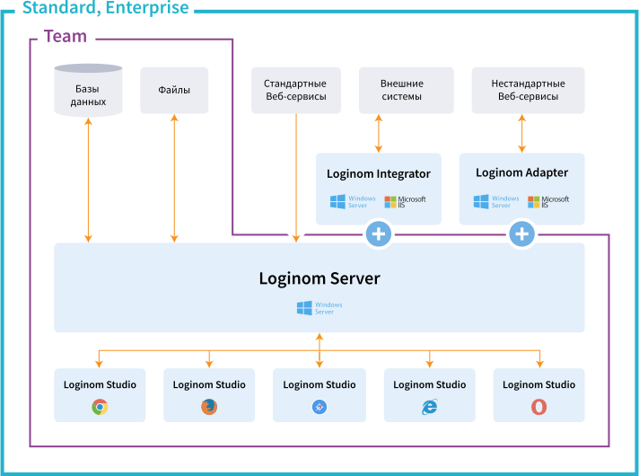

# Loginom — руководство администратора

Аналитическая платформа [Loginom](https://loginom.ru) может функционировать в серверном режиме для коллективной работы и в виде настольного приложения для персональной аналитики.

## Коллективная работа

Серверный режим доступен в редакциях Team, Standard и Enterprise.

| Компонент | Назначение |
|:----------|:-----------|
| [Server](./server/README.md) | Ключевой элемент платформы. Требует инсталляции и функционирует в виде службы Windows. Взаимодействие между всеми компонентами платформы осуществляется через Loginom Server.|
| [Integrator](./integrator/README.md) | Компонент, необходимый для публикации веб-сервисов. Работает совместно с Loginom Server. Требует инсталляции и функционирует в виде службы Microsoft IIS.|
| [Adapter](./adapter/README.md) | Компонент, необходимый для интеграции с нестандартными веб-сервисами. Требует инсталляции и функционирует в виде службы Microsoft IIS. |
| [Studio](./studio/README.md) | Клиентское веб-приложение, реализующее пользовательский интерфейс работы с платформой. Не требует инсталляции, т.к. взаимодействие осуществляется через браузер. |

## Персональная аналитика

Настольные компоненты, предназначенные для автономной обработки данных на персональном компьютере, доступны в редакциях Academic и Personal. Содержат единственный компонент [Loginom Desktop](./desktop/README.md).

Требуют инсталляции и функционируют в виде Windows приложения. Доступны 32-х и 64-х разрядные редакции.
