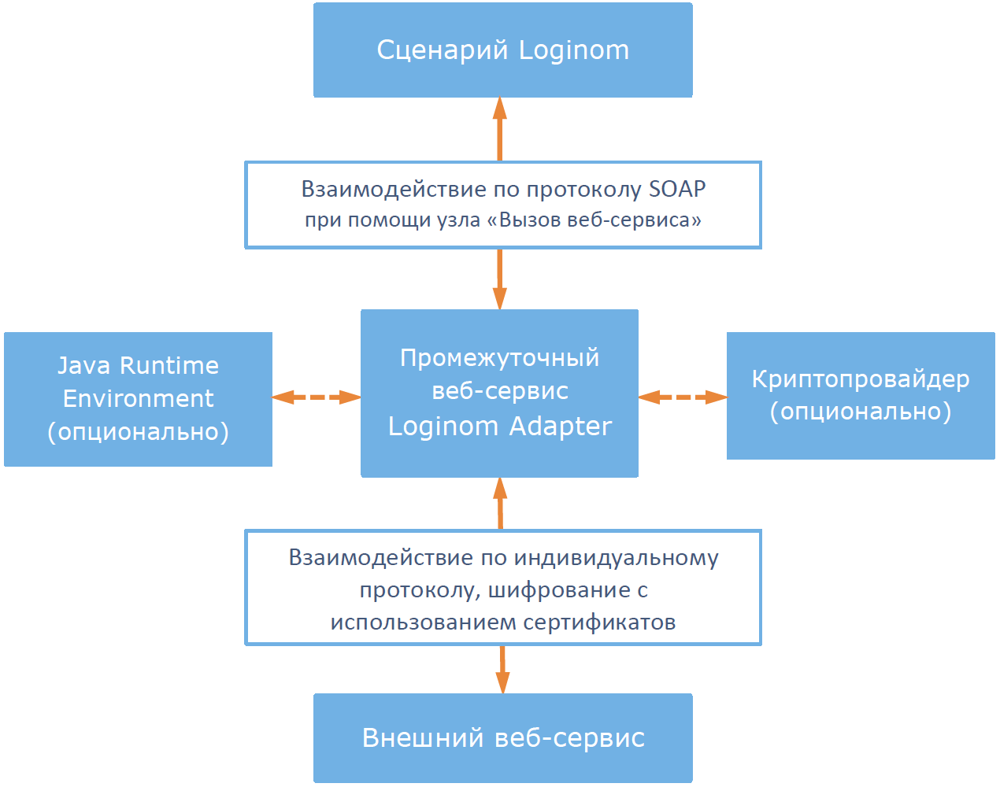

# Loginom Adapter

В аналитической платформе Loginom имеются [компоненты интеграции с SOAP и REST сервисами](https://help.loginom.ru/userguide/integration/web-services/), которые реализуют наиболее распространенные варианты взаимодействия с веб-сервисами. Но некоторые веб-сервисы, например, БКИ используют индивидуальные протоколы и шифрование данных, при которых взаимодействовать с ними стандартными средствами Loginom невозможно. Для решения этой задачи предназначен Loginom Adapter (далее, *Адаптер*).

*Адаптер* представляет собой промежуточный веб-сервис между реализованным в Loginom сценарием и внешними веб-сервисами. Взаимодействие с *Адаптером* из сценария Loginom происходит по стандартному SOAP-протоколу при помощи узла [Вызов веб-сервиса](https://help.loginom.ru/userguide/processors/integration/calling-web-service.html). В свою очередь *Адаптер*:

- Преобразует полученный из сценария Loginom SOAP-запрос к формату запроса внешнего веб-сервиса;
- Направляет преобразованный запрос во внешний веб-сервис;
- Получает ответ внешнего веб-сервиса;
- Преобразует полученный ответ и в формате SOAP возвращает его сценарию Loginom.

## Системные требования

### Аппаратное обеспечение

| Компонент | Минимальные | Рекомендуемые |
|:--- |:---|:--- |
| Процессор | Intel Core 2 Duo | Intel Xeon |
| Оперативная память | 1 Гб | 8 Гб |
| Жесткий диск | 10 Гб | 500 Гб |
| Управление | Клавиатура, мышь | &nbsp; |

### Обязательное программное обеспечение

| Компонент | Минимальные | Рекомендуемые |
|:--- |:---|:--- |
| Операционная система | Windows 7 | Windows Server 2008 и выше |
| Microsoft IIS | Версия не ниже 5.1 | Версия 7.5 и выше |
| .Net Framework | Версия 3.5 | &nbsp; |

> **Примечание**: Loginom Adapter использует в работе .Net Framework версии 3.5. Практика использования программы показывает, что возможна совместимость с .Net Framework версии 4.5.

Для работы *Адаптера* требуется наличие ряда компонентов IIS и .Net Framework. Подробное описание см. в разделе [Установка](.\setup\README.md).

### Опциональное программное обеспечение

Для работы с некоторыми веб-сервисами могут использоваться сторонние криптопровайдеры (Cryptography Service Provider, CSP) и Java Runtime Environment (JRE). В таких случаях эти компоненты должны быть установлены на ПК вместе с *Адаптером*.

#### Cryptography Service Provider (CSP)

Для шифровании данных при интеграции с внешними веб-сервисами используются криптопровайдеры, например, Signal-COM CSP или CryptoPro CSP. Выбор криптопровайдера и его версии диктуется требованиями поддержки в нем необходимых для взаимодействия с конкретным веб-сервисом алгоритмов шифрования.

Для работы с тем или иным веб-сервисом с применением шифрования потребуются соответствующие сертификаты.

#### Java Runtime Environment (JRE)

Java Runtime Environment (JRE) версии не ниже 6 — обязательное требование для подключения к сервисам [Национальный Хантер](https://bki-okb.ru/corp/services/national-hunter) и [Equifax FPS](https://www.equifax.ru).
