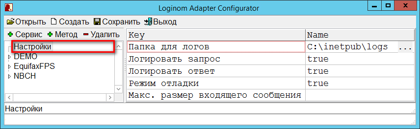
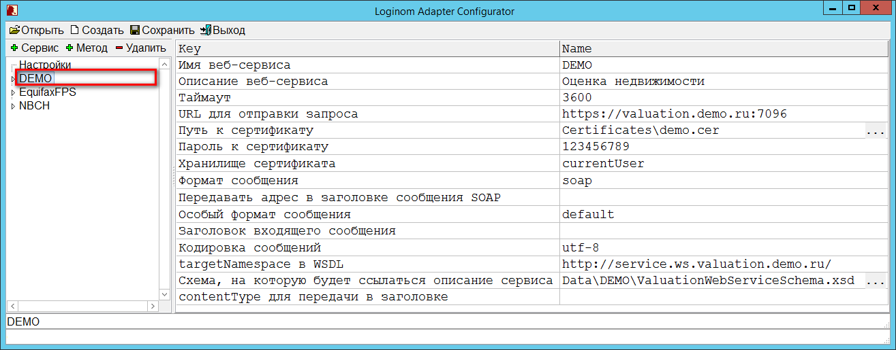
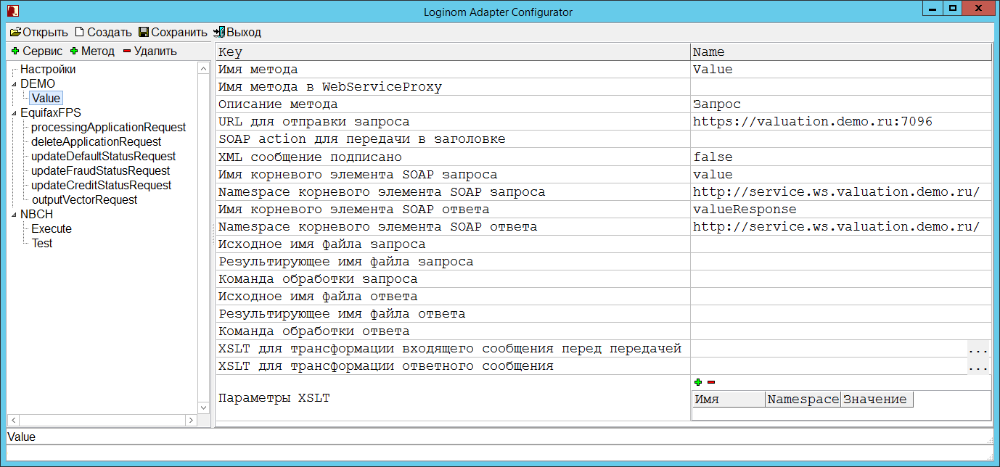

# Описание параметров настроек

## Параметры общих настроек

Для отображения общих настроек *Адаптера* необходимо выделить элемент `Настройки` в дереве навигации (см. рисунок 4).



Общие настройки представлены следующими параметрами:

* **Папка для логов** — путь к папке для лог-файлов *Адаптера*. Если параметр не задан, то логи не сохраняются. Выбрать путь можно нажатием на кнопку . При выборе данного параметра нужно учитывать, что пользователь должен иметь право на чтение и запись в папку для лог-файлов.
* **Логировать запрос** — флаг, указывающий, что в лог необходимо сохранять xml-запрос к *Адаптеру*. Данному параметру можно задать значения `true` или `false`.
* **Логировать ответ** — флаг, указывающий, что в лог необходимо сохранять xml ответы *Адаптера*. Данному параметру можно задать значения `true` или `false`.
* **Режим отладки** — флаг, указывающий, что при ошибках в работе *Адаптера* следует выдавать отладочную информацию. Эта информация выводится при запросе WSDL сервиса. Данному параметру можно задать значения `true` или `false`. На этапе настройки рекомендуется включить режим отладки и логирование запросов и ответов. Это позволит получить детальную информацию для решения возможных проблем с настройкой.
* **Макс. размер входящего сообщения** — максимально допустимый размер входящего xml-сообщения в байтах (по умолчанию 10 Мб).

## Параметры настроек подключения к внешним сервисам

Для отображения настроек подключения к внешнему сервису необходимо выделить соответствующий ему элемент в дереве навигации (см. рисунок 5).



Перечень (содержание столбца *Key*) параметров одинаков для подключений ко всем сервисам, и включает в себя следующие параметры:

* **Имя веб-сервиса** — уникальное имя веб-сервиса. Значение параметра используется в качестве составной части имен (name) элементов и атрибутов WSDL-описания веб-сервиса *Адаптера*. В связи с этим значение параметра подчиняется правилам именования элементов XML в соответствии со [спецификацией W3C](https://www.w3.org/TR/2008/REC-xml-20081126/#NT-Name). Обязательный параметр.
* **Описание веб-сервиса** — произвольное описание веб-сервиса. Необязательный параметр.
* **Таймаут** — максимально допустимое время в секундах между запросом и ответом об окончании обработки запроса. Необязательный параметр.
* **URL для отправки запроса** — адрес веб-сервиса, куда будут отправляться запросы.
* **Путь к сертификату** — при использовании шифрования указывается путь к клиентскому сертификату.

> **Примечание**: при указании пути к сертификату допустимо использование как абсолютных путей (с указанием буквы диска), так и относительных. В последнем случае путь задается относительно папки, в которой расположен файл `Web.config`.

* **Пароль к сертификату** — для операций с некоторыми сертификатами требуется пароль.
* **Хранилище сертификата** — может принимать одно из трех значений: `none`, `currentUser`, `localMachine`. Если клиентский сертификат имеет закрытый ключ, то он помещается в одно из хранилищ сертификатов — в хранилище локальной машины (*localMachine*) или хранилище текущего пользователя (*currentUser*). Сертификаты без закрытого ключа могут располагаться отдельным файлом по указанному в параметре *Путь к сертификату* месте файловой системы. Для таких сертификатов в параметре *Хранилище сертификатов* указывается значение `none`.

> **Примечание**: в случае, когда клиентский сертификат находится в хранилище, обязательна процедура экспорта из хранилища в файл `.CER` в DER-кодировке `X.509` и указания пути к этому файлу в параметре *Путь к сертификату*. В противном случае *Адаптер* не сможет обратиться к клиентскому сертификату, расположенному в хранилище (см. также раздел [Работа с сертификатами](./work-with-certificates.md)).

* **Формат сообщения** — может принимать одно из трех значений: `plainXml`, `soap`, `soap12`. Значение зависит от веб-сервиса, к которому осуществляется подключение. Значение `plainXml` параметра задает режим работы с внешним сервисом как с REST-сервисом. Значения `soap`, `soap12` параметра задают режим работы с внешним сервисом как с SOAP-сервисом в спецификациях 1.1 и 1.2 соответственно.
* **Передавать адрес в заголовке сообщения SOAP** — флаг, указывающий на необходимость передачи адреса в заголовке (секции *Header*) сообщения SOAP. Флаг нужно указывать для веб-сервисов, в WSDL-описании которых задана политика `UsingAddressing`.
* **Особый формат сообщения** — используется для веб-сервисов с нестандартным форматом сообщений, в частности для БКИ «ОКБ». Может принимать значения: `default`, `experianEncoding`. Необязательный параметр.
* **Заголовок входящего сообщения** — применяется для БКИ «ОКБ». В таком заголовке может передаваться дополнительная информация (например, имя пользователя, пароль и т.д.).
* **Кодировка сообщений** — указывается кодировка сообщений, применяемая внешним сервисом. Может принимать значения: `utf-8`, `windows-1251`. По умолчанию используется `utf-8`.
* **targetNamespace в WSDL** — значение берется из одноименного атрибута WSDL-описания внешнего сервиса. Применяется только для SOAP-сервисов.
* **Схема, на которую будет ссылаться описание сервиса** — задает путь к XSD-схеме описания сервиса. Схема описывает структуру XML-сообщений запросов и ответов веб-сервиса *Адаптера* и участвует в формировании WSDL-описания сервиса. XSD-схема может содержать ссылки на связанные XSD-схемы. Обязательный параметр.
* **ContentType для передачи в заголовке** — значение данного параметра передается в заголовке `Content-Type` пакета сообщения к внешнему сервису. Используется для работы с БКИ «ОКБ».

## Параметры настроек методов взаимодействия с внешними сервисами

Для отображения настроек методов взаимодействия с внешним сервисом необходимо выделить соответствующий ему элемент в дереве настроек (см. рисунок 6).



Данные настройки включают в себя следующие параметры:

* **Имя метода** — в случае если параметр *Имя метода в Loginom Adapter* не задан, значение параметра используется в качестве составной части имен(name) элементов и атрибутов WSDL-описания веб-сервиса *Адаптера*. В этом случае значение параметра подчиняется правилам именования элементов XML в соответствии со [спецификацией W3C](https://www.w3.org/TR/2008/REC-xml-20081126/#NT-Name). Обязательный параметр.
* **Имя метода в Loginom Adapter** — используется для формирования имен элементов в WSDL-описании веб-сервиса в случае совпадения значений параметра *Имя метода* для различных методов конфигурации *Адаптера*. Если оставить данный параметр пустым, то для формирования имен элементов в WSDL используется параметр *Имя метода*. Поскольку параметр используется в качестве составной части имен (name) элементов и атрибутов WSDL-описания, значение параметра подчиняется правилам именования элементов XML в соответствии со [спецификацией W3C](https://www.w3.org/TR/2008/REC-xml-20081126/#NT-Name). Необязательный параметр.
* **Описание метода** — произвольное описание метода. Необязательный параметр.
* **URL для отправки запроса** — адрес веб-сервиса, куда будут отправляться запросы. Обязательный параметр.
* **SOAPAction для передачи в заголовке** — значение данного параметра передается в заголовке `SOAPAction` HTTP/HTTPS-пакета, передаваемого внешнему сервису. Определяет вызываемый метод внешнего SOAP-сервиса. Данный параметр должен содержать наименование метода из wsdl-описания SOAP-сервиса. Параметр указывается в зависимости от требований к настройке соответствующего веб-сервиса.
* **XML-сообщение подписано сертификатом** — принимает значения `true`, `false`. При значении `true` задействуется алгоритм преобразования ответа БКИ «НБКИ», в котором из XML ответа сервиса удаляется подпись сертификатом. Пустое значение параметра равносильно `false`.
* **Имя корневого элемента SOAP запроса**, **Namespace корневого элемента SOAP запроса** — значения этих параметров берутся из XSD-схемы описания запроса.
* **Имя корневого элемента SOAP ответа**, **Namespace корневого элемента SOAP ответа** — значения этих параметров берутся из XSD-схемы описания запроса.

> **Примечание**: путь к XSD-схеме указывается в параметре *Схема, на которую будет ссылаться описание сервиса*.

* **Исходное имя файла запроса**, **Результирующее имя файла запроса**, **Команда обработки файла запроса** — данные параметры используются для задания команды ОС (операционной системы) предварительной обработки текста запроса перед его отправкой внешнему сервису. Подробнее о работе параметров см. в разделе [Настройка роли клиента внешних сервисов](./tuning-principles.md#nastroyka-roli-klienta-vneshnikh-servisov). Пример команды:

```
"C:\Program Files\7-Zip\7z" a -tzip "%outputFile%" "%inputFile%"

// шаблоны %inputFile% и %outputFile% при выполнении команды заменяются на значения параметров
// «Исходное имя файла запроса» и «Результирующее имя файла запроса» соответственно.
```

* **Исходное имя файла ответа**, **Результирующее имя файла ответа**, **Команда обработки ответа** — данные параметры используются для задания команды ОС обработки текста ответа сервиса. Работа параметров аналогична команде обработки запросов и описана в разделе [Настройка роли клиента внешних сервисов](./tuning-principles.md#nastroyka-roli-klienta-vneshnikh-servisov). Пример команды:

```
"C:\Program Files\7-Zip\7z" e "%inputFile%" -so > "%outputFile%"

// шаблоны %inputFile% и %outputFile% при выполнении команды заменяются на значения параметров
// «Исходное имя файла ответа» и «Результирующее имя файла ответа» соответственно.
```

* **XSLT для трансформации входящего сообщения перед передачей** — указывается путь к соответствующим файлам xslt-преобразований.
* **XSLT для трансформации ответного сообщения** — указывается путь к соответствующим файлам xslt-преобразований.
* **Параметры XSLT трансформации** — указываются в случае, если xslt-преобразования принимают входные параметры. Подробнее о применении и настройке данного параметра см. раздел [Настройка роли клиента внешних сервисов](./tuning-principles.md#nastroyka-roli-klienta-vneshnikh-servisov).
