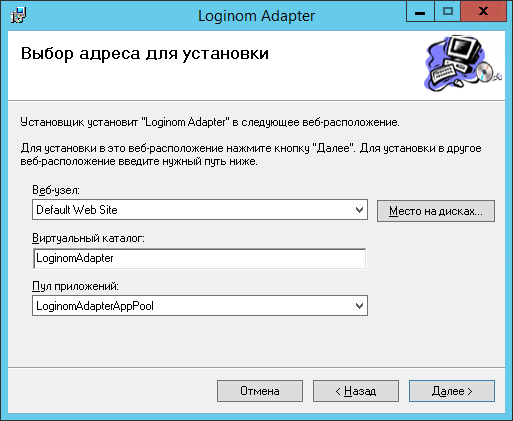

# Установка Loginom Adapter

## Подготовка к установке

Перед установкой *Адаптера* необходимо:

1. Убедиться, что следующие компоненты включены:
   * Microsoft Internet Information Server (IIS).
   * IIS -> Средства управления -> Управление совместимостью с IIS 6.
   * Для версий до Windows 2012:
     * .Net Framework 3.5.
     * .NET Framework 3.5 -> Активация по HTTP.
   * Для версий Windows 2012 и выше:
     * .Net Framework 3.5 (необходим только для установщика).
     * .Net Framework 4.5.
     * .NET Framework 4.5 -> Службы WCF -> Активация по HTTP.
1. Создать и настроить [особую учетную запись](./special-user.md).
1. [Настроить IIS](./iis-config.md).
1. При необходимости следует установить опциональное программное обеспечение:
   * Криптопровайдер — если использование *Адаптера* подразумевает использование шифрования.
   * Java Runtime Environment — если это необходимо для подключения к конкретному веб-сервису.

Установку указанных в пункте 1 компонентов можно произвести из консоли при помощи команд:

```cmd
// для .Net Framework 3.5:
dism /online /enable-feature /all /FeatureName:NetFx3
dism /online /enable-feature /all /FeatureName:WCF-HTTP-Activation

// для IIS:
dism /online /enable-feature /FeatureName:IIS-WebServerRole
dism /online /enable-feature /FeatureName:IIS-WebServer
dism /online /enable-feature /FeatureName:IIS-WebServerManagementTools
dism /online /enable-feature /FeatureName:IIS-ManagementScriptingTools
dism /online /enable-feature /FeatureName:IIS-IIS6ManagementCompatibility

// для .Net Framework 4.5:
dism /online /enable-feature /all /FeatureName:NetFx4
dism /online /enable-feature /all /FeatureName:WCF-HTTP-Activation45
```

Команду `dism` можно дополнить параметрами для ограничения доступа к серверу обновления Windows Update и указания дистрибутива: `dism … /LimitAccess /Source:<source>`, где `<source>` — месторасположение дистрибутива, например,

```cmd
dism /online /enable-feature /all /FeatureName:NetFx3 /LimitAccess /Source:D:\sources\sxs
```

## Установка MSI

Имя установочного файла состоит из названия и версии продукта: `LoginomAdapter_6.x.x.msi`, где 6.x.x — цифры, обозначающие версию и релиз программы.

Запуск программы установщика следует производить из консоли, запущенной с правами Администратора. Иначе будет выведено окно с сообщением: `отсутствуют необходимые права… Войдите в систему под именем администратора…`.

Если во время подготовки все было настроено верно, появится окно установщика.

На странице **Выбор адреса для установки** назначаем следующие значения параметров:



* **Веб-узел** — по умолчанию `Default Web Site` (можно задать другой, созданный в диспетчере служб IIS);
* **Виртуальный каталог** — имя каталога, где будет размещено установленное приложение (по умолчанию, `LoginomAdapter`);
* **Пул приложений** — выбираем созданный в диспетчере служб IIS пул, например, `LoginomAdapterAppPool`.

По умолчанию программа будет установлена в `C:\inetpub\wwwroot\LoginomAdapter\`.

> **Важно**: компьютер, на котором работает *Адаптер*, должен иметь сетевой доступ к внешним сервисам.

## Настройка лицензии Loginom Adapter

Для работы *Адаптера* требуется настройка [ключей лицензирования](../../licenses/README.md).

При использовании сервера сетевых ключей требуется отредактировать файл [GnClient.ini](https://dev.guardant.ru/pages/viewpage.action?pageId=1277980) в каталоге `"C:\ProgramData\BaseGroup\Loginom 6\Adapter"`, указав в секции `[Server]` в поле `IP_NAME` адрес сервера ключей.

## Проверка работоспособности

Для проверки работоспособности необходимо в браузере перейти по URL: `http://<Server>/LoginomAdapter/Service.svc?wsdl`, где `<Server>` — имя хоста Loginom Adapter.

Пример: `http://localhost/LoginomAdapter/service.svc?wsdl`

*Адаптер* должен отдать WSDL SOAP веб-сервиса с сообщением наподобие:

```xml
<wsdl:definitions xmlns:wsdl="http://schemas.xmlsoap.org/wsdl/" …>
…
</wsdl:definitions>
```

## Перенос приложения Loginom Adapter на другой компьютер

Перенос/копирование развернутого приложения *Адаптера* на другой компьютер можно сделать без использования дистрибутива, перенеся каталог установки ранее развернутого приложения в каталог существующего сайта IIS на другом компьютере. Если используется созданный по умолчанию сайт `DefaultWebSite`, то перенос осуществляется в папку `C:\inetpub\wwwroot`. После этого папка приложения будет отображена в оснастке IIS, в группе `сайты` -> `Default Web Site`, где ее необходимо преобразовать в приложение. Это можно сделать при помощи соответствующего пункта контекстного меню — *Преобразовать в приложение*. В открывшемся окне нужно выбрать заранее созданный пул приложений, например,  `LoginomAdapterAppPool`.

Если веб-сервис не запущен, то необходимо запустить его с помощью контекстного меню в диспетчере служб IIS.

> **Важно**: перенос приложения *Адаптера* должен осуществляться на компьютер с выполненной [Подготовкой к установке](./#podgotovka-k-ustanovke).
